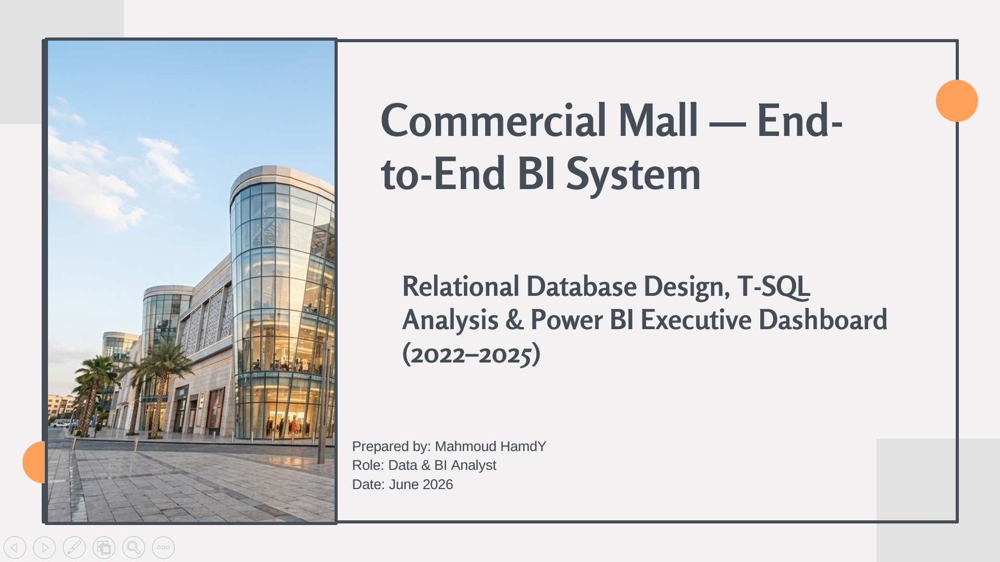
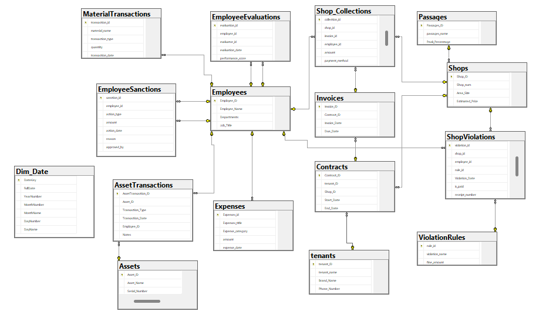
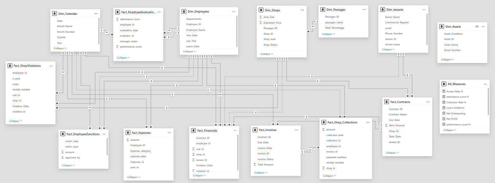
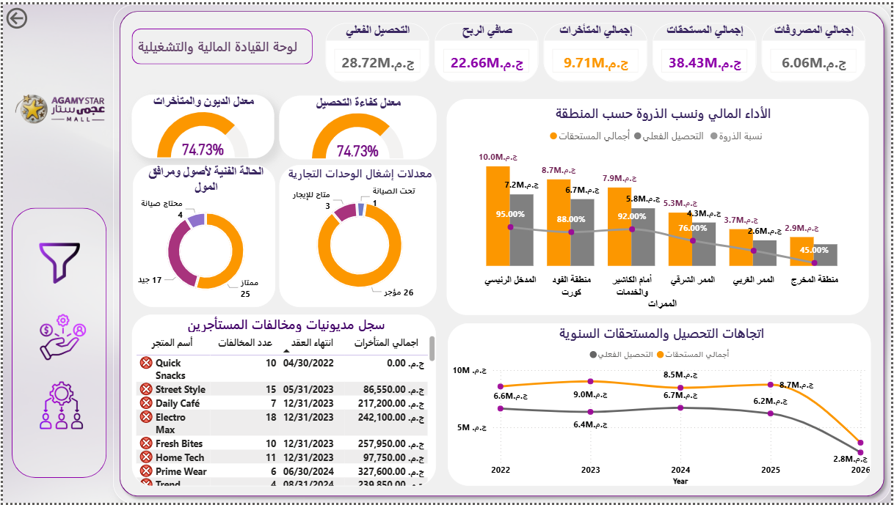
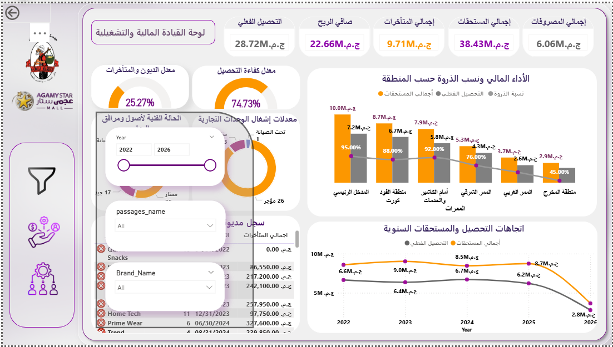
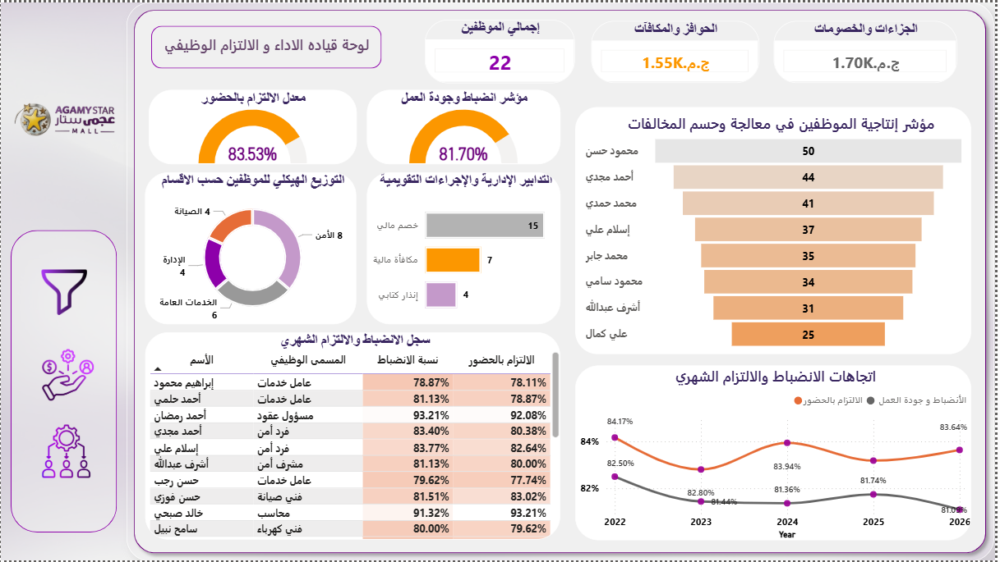

# 🏢 Agamy Star Mall — End-to-End Business Intelligence System

<div align="center">



[](https://www.microsoft.com/sql-server)
[](https://powerbi.microsoft.com)
[](#)
[](#)

**A full-cycle BI project simulating a real commercial mall — from relational database design and SQL analysis to a production-grade Power BI executive dashboard.**

[Overview](#-project-overview) · [Database Design](#-database-design) · [SQL Analysis](#-sql-analysis) · [Power BI Model](#-power-bi-data-model) · [Dashboard](#-dashboard-pages) · [Key Findings](#-key-analytical-findings) · [Setup](#-setup--usage)

</div>

---

## 📌 Project Overview

This project simulates the complete data pipeline and analytical layer for **Agamy Star Mall**, a multi-tenant commercial shopping center. The goal was to build a realistic, fully integrated BI system from scratch — including database design, realistic data population, SQL-level analysis, Power BI modeling, and an executive-grade reporting layer.

The project was structured around a real business question:

> *"Is the mall operating at its full financial potential — and if not, where exactly is the value leaking?"*

The answer, as revealed by the data, is that **the mall is commercially strong but financially underperforming**, with a persistent collection gap of ~25% that has compounded across four consecutive fiscal years (2022–2026).

---

### 🎯 Project Goals

| Goal | Description |
|------|-------------|
| **Business Understanding** | Translate mall operations into data entities and business KPIs |
| **Database Engineering** | Design a normalized relational schema in SQL Server |
| **Data Simulation** | Populate with realistic, consistent synthetic data |
| **SQL Analysis** | Write business-driven queries and reusable views |
| **BI Modeling** | Build a Galaxy Schema in Power BI with proper relationships |
| **DAX Engineering** | Create calculated measures for financial and HR analytics |
| **Executive Reporting** | Deliver a 2-page dashboard for C-level decision-making |

---

## 🗂️ Repository Structure

```
MallManagementSystem/
│
├── 📁 sql/
│   ├── Commercial_Mall_Schema_Setup.sql          # Schema + table creation + Dim_Date
│   └── Analytics_Layer_And_Views.sql             # Business analysis queries + views
│
├── 📁 powerbi/
│   └── Commercial_Mall_Executive_Dashboard.pbix  # Power BI report file
│
├── 📁 screenshots/
│   ├── banner.png                                # Project banner
│   ├── erd_diagram.png                           # SQL Server ERD
│   ├── powerbi_model.png                         # Power BI Galaxy Schema
│   ├── dashboard_financial.png                   # Page 1 — Financial Dashboard
│   ├── dashboard_financial_filter.png            # Page 1 — Financial Dashboard (filtered view)
│   └── dashboard_hr.png                          # Page 2 — HR & Workforce Dashboard
│
└── README.md
```

---

## 🗄️ Database Design

### Methodology

The design process followed a structured engineering approach:

1. **Business Domain Analysis** — Mapped all mall operations: tenancy, collections, violations, HR, assets, and expenses into logical entities.
2. **ERD Design** — Drew the entity-relationship diagram before writing a single line of SQL.
3. **Normalization** — Applied 3NF normalization across all tables, eliminating redundancy.
4. **Constraint Engineering** — Every table includes typed constraints: `PK`, `FK`, `UNIQUE`, `CHECK`, and `DEFAULT` to enforce data integrity at the database layer.
5. **Date Dimension** — A standalone `Dim_Date` table was pre-generated (2020–2030) to support time-intelligence queries.

---

### Entity Relationship Diagram (ERD)

> *(SQL Server — ssms diagram view)*



---

### Schema Overview

The database contains **15 tables** organized into two layers:

#### Parent Tables (Dimension Entities)

| Table | Description | Key Constraints |
|-------|-------------|-----------------|
| `Passages` | Mall zones/corridors with peak footfall % | `CHECK` on Peak_Percentage (0–100) |
| `Shops` | All retail units with area, price, and status | `CHECK` on status, `UNIQUE` on Shop_num |
| `tenants` | Tenant registry with commercial registration | — |
| `Employees` | All staff (current + former) with hire/leave dates | `CHECK` Leave_Date ≥ Hire_Date |
| `Assets` | Equipment and facility assets | `CHECK` on condition values |
| `ViolationRules` | Static fine/penalty rule catalog | — |
| `Dim_Date` | Pre-generated calendar dimension | `UNIQUE` FullDate |

#### Child Tables (Transactional/Fact Entities)

| Table | Description | Key Relationships |
|-------|-------------|-------------------|
| `Contracts` | Lease contracts linking tenants to shops | → Tenants, Shops |
| `Invoices` | Monthly rent invoices per contract | → Contracts |
| `Shop_Collections` | Actual cash collection records | → Shops, Invoices, Employees |
| `ShopViolations` | Shop violation log with payment tracking | → Shops, Employees, ViolationRules |
| `EmployeeEvaluations` | Monthly performance/attendance scores (1–5) | → Employees (self-ref evaluator) |
| `EmployeeSanctions` | Financial penalties, bonuses, warnings | → Employees |
| `MaterialTransactions` | Inventory in/out records | → Employees |
| `Expenses` | Operating cost log by category | → Employees |
| `AssetTransactions` | Asset movement and lifecycle log | → Assets, Employees |

---

### Referential Integrity Design

All foreign keys are configured with deliberate `ON DELETE` / `ON UPDATE` behavior:

```sql
-- Example: Cascade shop number updates to contracts
CONSTRAINT FK_Shop_ID FOREIGN KEY (Shop_ID) 
    REFERENCES Shops(Shop_ID)
    ON DELETE NO ACTION
    ON UPDATE CASCADE

-- Example: Prevent orphan collections if invoice is deleted
CONSTRAINT FK_Collections_Invoices FOREIGN KEY (invoice_id) 
    REFERENCES Invoices(Invoice_ID)
    ON DELETE NO ACTION
    ON UPDATE NO ACTION
```

> Business logic enforced at the DB layer — not just the application layer.

---

## 📊 SQL Analysis

### Design Philosophy

Every SQL query in this project is structured around a **business question**, not just a data operation. Each analysis block follows this pattern:

```
Business Question → Why It Matters → Key Outputs → SQL Logic → Reusable VIEW
```

---

### Analysis Modules

#### 1. Financial Health Summary
> *"Are we collecting the revenue we expect?"*

Computes the gap between total billed invoices and actual cash collected — the single most important KPI in the system.

```sql
SELECT 
    SUM(Total_Amount)                                                       AS Expected_Revenue,
    (SELECT SUM(Amount) FROM Shop_Collections)                              AS Actual_Collection,
    SUM(Total_Amount) - (SELECT SUM(Amount) FROM Shop_Collections)          AS Due_Balance
FROM Invoices;
```

---

#### 2. Monthly Operating Expenses Trend
> *"Where are costs increasing and why?"*

Segments expenses by category (maintenance, utilities, payroll) across months — enabling cost spike detection.

---

#### 3. Passage Performance
> *"Do high-traffic zones generate proportionally higher revenue?"*

Joins `Passages → Shops → Contracts` to compute revenue per zone, active shop count, and price per sqm — filtered to active contracts only.

```sql
SELECT
    passages_name, Peak_Percentage,
    SUM(C.Rent_Amount)          AS Total_Revenue,
    COUNT(S.Shop_ID)            AS Active_Shops,
    CAST(SUM(C.Rent_Amount) / SUM(S.area_size) AS DECIMAL(10,2)) AS AvgPricePerSQM
FROM Passages P
INNER JOIN Shops S ON P.Passages_ID = S.Passages_ID
INNER JOIN Contracts C ON S.Shop_ID = C.Shop_ID
WHERE C.End_Date >= GETDATE() AND Contract_Status = N'نشط'
GROUP BY passages_name, Peak_Percentage;
```

---

#### 4. Tenant Risk Analysis
> *"Which tenants are becoming a financial liability?"*

Counts violations per tenant during their contract window and aggregates fine amounts — sorted by risk severity.

---

#### 5. Overdue Invoice Seasonality
> *"Are payment defaults concentrated in specific months?"*

Groups unpaid invoices by month to detect seasonal collection pressure.

---

#### 6. Employee Performance Summary
> *"How does each employee perform across evaluations, violations captured, and disciplinary actions?"*

Uses **three CTEs** to combine: evaluation scores + captured violations + financial sanctions into a single ranked view.

```sql
WITH Evaluation_CTE AS (
    SELECT employee_id,
           CAST(AVG((attendance_score + performance_score) / 2.0) AS DECIMAL(10,2)) AS Avg_Score
    FROM EmployeeEvaluations GROUP BY employee_id
),
Sanctions_CTE AS (...),
ShopViolations_CTE AS (...)
SELECT E.Employee_Name, E.Job_Title, EC.Avg_Score,
       ISNULL(S.Count_Violation, 0) AS Captured_Violations,
       ISNULL(SC.Sanctions_Count, 0) AS Sanctions_Count
FROM Employees E
LEFT JOIN Evaluation_CTE EC ON E.Employee_ID = EC.employee_id
...
```

---

#### 7. Asset Condition Summary
> *"What is the technical health of our facility assets?"*

Groups assets by name and condition to support maintenance planning.

---

### Reusable Views

All 7 analysis modules are also persisted as SQL `VIEW` objects for direct consumption in Power BI:

| View Name | Purpose |
|-----------|---------|
| `v_Financial_Summary` | Revenue vs collection KPIs |
| `v_Expenses_Monthly_Trend` | Monthly cost breakdown by category |
| `v_Passages_Performance` | Zone-level revenue and footfall analysis |
| `v_Tenants_At_Risk` | Tenant risk scoring |
| `v_Overdue_Invoices_Seasonality` | Seasonal default pattern |
| `v_Employee_Performance_Summary` | HR composite performance view |
| `v_Assets_Condition_Summary` | Asset health registry |

---

## 🧩 Power BI Data Model

### Schema Design: Galaxy Schema

The Power BI model was designed as a **Galaxy Schema** (also called a multi-fact star schema). This was a deliberate architectural choice — the business data spans multiple independent fact domains that cannot be merged into a single fact table without loss of grain or semantic accuracy.


<!-- Replace with: screenshots/powerbi_model.png -->

---

### Model Architecture

#### Dimension Tables

| Dimension | Key Fields | Role |
|-----------|-----------|------|
| `Dim_Calendar` | Date, Year, Month, Quarter | Time-intelligence across all facts |
| `Dim_Employees` | Employee_ID, Name, Job_Title, Department | HR and collections attribution |
| `Dim_Shops` | Shop_ID, Shop_num, Area_Size, Status | Retail unit master |
| `Dim_Passages` | Passages_ID, Name, Peak_Percentage | Zone/corridor master |
| `Dim_tenants` | tenant_ID, Brand_Name, Commercial_Register | Tenant master |
| `Dim_Assets` | Asset_ID, Name, Condition | Asset registry |

#### Fact Tables

| Fact | Grain | Key Measures |
|------|-------|-------------|
| `Fact_Invoices` | One row per invoice | Total_Amount, Invoice_Status |
| `Fact_Shop_Collections` | One row per payment | amount, payment_method |
| `Fact_Contracts` | One row per contract | Rent_Amount, Contract_Status |
| `Fact_Expenses` | One row per expense | amount, Expense_category |
| `Fact_ShopViolations` | One row per violation | is_paid, rule_id |
| `Fact_EmployeeEvaluations` | One row per monthly eval | attendance_score, performance_score |
| `Fact_EmployeeSanctions` | One row per sanction | amount, action_type |

---

### DAX Measures

All KPIs are calculated as explicit DAX measures in an isolated `All_Measures` table:

```dax
-- Core Financial Measures
Total Due          = SUM('Fact_Invoices'[Total_Amount])
Total Collections  = SUM('Fact_Shop_Collections'[amount])
Net Outstanding    = [Total Due] - [Total Collections]
Net Profit         = [Total Collections] - [Total Expenses]
Total Expenses     = SUM(Fact_Expenses[amount])

-- Collection & Arrears Rates
Collection Rate %  = DIVIDE([Total Collections], [Total Due], 0)
Arrears Rate %     = 1 - [Collection Rate %]

-- Violation Count (with bidirectional cross-filter)
count violations = 
CALCULATE(
    COUNT('Fact_ShopViolations'[violation_id]),
    CROSSFILTER('Dim_Shops'[Shop_ID], 'Fact_Contracts'[shop_id], Both)
)

-- HR Performance Measures
attendance_score % = 
DIVIDE(
    SUM('Fact_EmployeeEvaluations'[attendance_score]),
    COUNT('Fact_EmployeeEvaluations'[attendance_score]) * 5, 0
)

performance_score % = 
DIVIDE(
    SUM('Fact_EmployeeEvaluations'[performance_score]),
    COUNT('Fact_EmployeeEvaluations'[performance_score]) * 5, 0
)

-- Calendar Dimension (calculated table)
Dim_Calendar = 
ADDCOLUMNS(
    CALENDAR(DATE(2022, 1, 1), DATE(2030, 12, 31)),
    "Year",         YEAR([Date]),
    "Month Name",   FORMAT([Date], "MMMM"),
    "Month Number", MONTH([Date]),
    "Quarter",      "Q" & FORMAT([Date], "Q")
)
```

---

## 📈 Dashboard Pages

The report is structured across **two pages**, each designed for a distinct audience and decision layer.

---

### Page 1 — Financial & Operational Leadership Dashboard

**Purpose:** Executive-level view of revenue health, collection performance, zone analysis, and tenant risk.



*Filtered view — drill-down by zone or tenant:*



#### Key Visuals

| Visual | Insight Delivered |
|--------|------------------|
| **5 Top KPI Cards** | Total Receivables · Actual Collections · Outstanding · Net Profit · Total Expenses |
| **Collection Efficiency Gauge** | 74.73% vs industry benchmark (~88–92%) |
| **Occupancy Donut** | 26 rented / 3 available / 1 maintenance |
| **Zone Performance Bar Chart** | Receivables vs collected by zone, overlaid with peak footfall % |
| **Annual Trend Line** | 4-year receivables vs collections gap (2022–2025) |
| **Tenant Arrears Table** | Ranked by outstanding balance with violation count and contract end date |
| **Asset Condition Donut** | 25 Excellent · 17 Good · 4 Needs Maintenance |

---

### Page 2 — HR & Workforce Performance Dashboard

**Purpose:** HR management view of attendance compliance, individual performance, disciplinary patterns, and department structure.



#### Key Visuals

| Visual | Insight Delivered |
|--------|------------------|
| **3 Top KPI Cards** | Total Staff (22) · Bonuses (1.55K) · Penalties (1.70K) |
| **Attendance Rate Gauge** | 83.53% compliance rate |
| **Work Quality Gauge** | 81.70% performance score |
| **Department Donut** | Security (8) · General Services (6) · Maintenance (4) · Admin (4) |
| **Sanctions Bar Chart** | Financial deductions (15) vs bonuses (7) vs written warnings (4) |
| **Individual Productivity Ranking** | Staff ranked by violation-capture score |
| **Compliance Trend Line** | Monthly attendance vs work quality trends by year |

---

## 🔍 Key Analytical Findings

### 1. The Collection Gap is Structural, Not Seasonal

The 25% collection shortfall persists across all fiscal years (2022–2026) with no recovery trend:

| Year | Receivables | Collected | Gap |
|------|-------------|-----------|-----|
| 2022 | EGP 8.5M | EGP 6.6M | **1.9M** |
| 2023 | EGP 9.0M | EGP 6.4M | **2.6M** ← worst full year |
| 2024 | EGP 8.5M | EGP 6.7M | **1.8M** |
| 2025 | EGP 8.7M | EGP 6.2M | **2.5M** |
| 2026 | EGP 2.2M* | EGP 2.8M* | *(YTD — partial year)* |

> \* 2026 figures are year-to-date and should not be read in isolation. The structural gap is confirmed by the 2022–2025 full-year pattern.

---

### 2. High-Traffic Zones Are High-Leakage Zones

| Zone | Peak Footfall | Receivables | Collected | Gap |
|------|--------------|-------------|-----------|-----|
| Main Entrance | 95% | 10.0M | 7.2M | **2.8M** |
| Cashier & Services | 92% | 7.9M | 5.8M | **2.1M** |
| Food Court | 88% | 8.7M | 6.7M | **2.0M** |
| East Passage | 76% | 5.3M | 4.3M | **1.0M** |
| West Passage | 45% | 3.7M | 2.6M | **1.1M** |
| Exit Zone | 45% | 2.9M | 2.9M | **0.0M** ✓ |

> High traffic does not automatically drive collections — the link is broken at contract/follow-up governance level.

---

### 3. Critical Tenant Risk Cases

| Tenant | Outstanding | Contract | Violations | Risk |
|--------|-------------|----------|------------|------|
| Golden Perfume | EGP 540,800 | Active | 2 | 🔴 CRITICAL |
| Trend House | EGP 239,850 | **Closed (Aug 2024)** | 4 | 🔴 CRITICAL |
| Mobile Hub | EGP 182,500 | Active | 5 | 🟠 HIGH |
| Fashion Zone | EGP 158,350 | Active | 5 | 🟠 HIGH |
| Family Store | EGP 171,350 | Active | 4 | 🟡 MEDIUM |

> Trend House is closed yet carries unresolved liabilities — a direct consequence of absent exit-settlement protocols.

---

### 4. HR: Attendance Does Not Equal Productivity

- Attendance Rate: **83.53%** — acceptable compliance
- Work Quality Score: **81.70%** — below compliance rate
- Penalties (1.70K) **exceed** Bonuses (1.55K) — punitive culture, no performance upside
- Top performers (score 50 and 44) are not currently assigned to high-impact collection roles

---

## 🛠️ Technical Stack

| Layer | Technology | Version |
|-------|-----------|---------|
| Database | Microsoft SQL Server | 2022 |
| Query Language | T-SQL | — |
| BI Tool | Power BI Desktop | Latest |
| Data Modeling | Galaxy Schema (multi-fact star) | — |
| Calculation Engine | DAX | — |
| Version Control | Git / GitHub | — |

---

## 🚀 Setup & Usage

### Prerequisites

- Microsoft SQL Server 2019 or later
- SQL Server Management Studio (SSMS)
- Power BI Desktop (latest version)

### Step 1 — Create the Database

```sql
-- Run the schema file in SSMS
-- File: sql/Commercial_Mall_Schema_Setup.sql

USE master;
GO
-- The script will:
-- 1. Create the MallManagementSystem database
-- 2. Create all 15 tables with constraints
-- 3. Generate Dim_Date (2020–2030)
```

### Step 2 — Run the Analysis Layer

```sql
-- Run the analysis file in SSMS
-- File: sql/Analytics_Layer_And_Views.sql

-- This will:
-- 1. Execute all 7 analysis queries
-- 2. Create all 7 reusable views
```

### Step 3 — Open the Power BI Report

1. Open `powerbi/Commercial_Mall_Executive_Dashboard.pbix` in Power BI Desktop
2. Go to **Home → Transform Data → Data Source Settings**
3. Update the SQL Server connection string to point to your local instance
4. Click **Refresh** to reload all data

---

## 📐 Design Decisions & Engineering Notes

### Why Galaxy Schema?

A single star schema would require merging `Fact_Invoices`, `Fact_Collections`, `Fact_Expenses`, `Fact_Violations`, and `Fact_Evaluations` into one table — which would destroy grain integrity and produce incorrect aggregations. Each fact table operates at a different grain and serves a different analytical purpose. The Galaxy Schema preserves this separation while enabling cross-domain analysis through shared dimension keys.

### Why Views Instead of Direct Queries?

The 7 SQL views act as a **semantic layer** between raw tables and Power BI. Benefits:
- Encapsulate business logic in one place
- Simplify Power Query imports
- Enable schema changes without breaking reports
- Serve as documented, reusable query contracts

### Why Explicit DAX Measures?

All KPIs are defined as explicit measures (not implicit) collected in a single `All_Measures` table. This enforces a clean separation between data and calculation, improves performance through VertiPaq optimization, and makes the model maintainable and self-documenting.

---

## 👤 Author

**Mahmoud Hamdi**
Data Analyst

 [LinkedIn](https://www.linkedin.com/in/mahmoud-hamdi-analyst) · [Email](mailto:mahmoudhamdiwm@gmail.com)
---

## 📄 License

This project is open-source and available under the [MIT License](LICENSE).

---

<div align="center">

*Built as a demonstration of end-to-end BI engineering — from database design to executive dashboard.*

</div>
